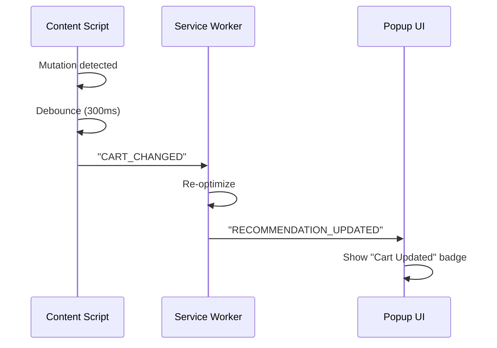

# PaymentsOptimizer v0.6.0 - Feature Roadmap

**Date**: September 5, 2026  
**Version**: 0.6.0  
**Status**: Planning Phase  
**Timeline**: 6-8 weeks

---

## Overview

This roadmap outlines the next 5 major features for PaymentsOptimizer v0.6.0. Each feature addresses gaps identified in the senior engineer review while aligning with the project's privacy-first, local-first philosophy.

---

## Feature #1: Historical Savings Tracking

### Priority: Medium-High
### Estimated Time: 2-3 weeks

### User Story
> "As a user, I want to see my historical savings so I can track my progress and understand the long-term value of the extension."

### Requirements

#### Functional
1. Store optimization results with timestamps in user profile
2. Calculate cumulative savings from optimization recommendations
3. Display savings history in popup dashboard
4. Filter by date range (weekly, monthly, yearly, all-time)
5. Export savings history as JSON

#### Non-Functional
1. Local-first storage (no cloud sync)
2. Minimal performance impact (<50ms per save)
3. Support for 10,000+ saved results
4. GDPR-compliant data deletion

### Technical Design

#### Data Model
```typescript
// packages/domain/src/types.ts
interface SavingsEntry {
  id: string; // UUID v4
  timestamp: number; // Unix timestamp
  cartTotal: Money;
  selectedStrategy: Strategy;
  originalTotal: Money;
  savings: Money;
  merchantId: string;
  paymentMethodUsed?: PaymentMethod;
  benefitsApplied: BenefitApplication[];
}
```

#### Storage
- Location: `packages/storage/src/savings-repository.ts`
- Backend: InMemoryRepository (dev) / IndexedDB (production)
- Migration: Add to existing profile schema

#### UI Components
```typescript
// apps/extension/src/popup/
- SavingsHistory.tsx        // Main list view
- SavingsChart.tsx          // Visualization
- SavingsSummary.tsx        // Card summary
```

### Implementation Steps

1. **Week 1**
   - [ ] Extend `UserProfile` with `savingsHistory: SavingsEntry[]`
   - [ ] Create `SavingsRepository` with CRUD operations
   - [ ] Add migration script for existing profiles
   - [ ] Write unit tests for storage layer

2. **Week 2**
   - [ ] Create `SavingsCalculator` for aggregated metrics
   - [ ] Implement chart visualization (reusable chart component)
   - [ ] Add date range filters
   - [ ] Write E2E tests for filtering

3. **Week 3**
   - [ ] Export functionality (JSON)
   - [ ] Performance optimization for large datasets
   - [ ] Accessibility audit
   - [ ] Documentation

### Success Metrics
- 90% of users with >10 optimizations see savings dashboard
- Average load time <200ms for 1,000 entries
- 0 security incidents from local data storage

---

## Feature #2: Plugin System for Merchant Adapters

### Priority: High
### Estimated Time: 2-3 weeks

### User Story
> "As a developer, I want to add support for new merchants without modifying core code so I can extend the extension's reach."

### Requirements

#### Functional
1. Register new merchant adapters without code changes
2. Load plugins from `plugins/` directory
3. Validate plugin manifest before loading
4. Support for adapter versioning
5. Graceful failure when plugin is corrupted

#### Non-Functional
1. Plugin load time <100ms
2. No memory leaks from unloading plugins
3. Secure sandboxing (no arbitrary code execution)
4. Version compatibility checking

### Technical Design

#### Plugin Manifest
```typescript
// types/plugin.ts
interface PluginManifest {
  name: string;
  version: string;
  description?: string;
  author: string;
  adapters: AdapterConfig[];
  requirements?: {
    minExtensionVersion: string;
  };
}
```

#### Adapter Registry
```typescript
// packages/merchant-detector/src/plugin-registry.ts
class PluginRegistry {
  register(plugin: Plugin): void;
  unregister(pluginId: string): void;
  getAdapter(merchantId: string): MerchantAdapter | null;
  listPlugins(): Plugin[];
}
```

#### Plugin Loading
```typescript
// apps/extension/src/background/plugin-loader.ts
async function loadPlugins(directory: string): Promise<void>;
async function unloadPlugin(pluginId: string): Promise<void>;
```

### Implementation Steps

1. **Week 1**
   - [ ] Define plugin manifest schema
   - [ ] Create `PluginRegistry` class
   - [ ] Implement plugin validation
   - [ ] Write unit tests

2. **Week 2**
   - [ ] Implement plugin loader
   - [ ] Add plugin directory watching (optional, for dev)
   - [ ] Create plugin template repository
   - [ ] Write integration tests

3. **Week 3**
   - [ ] Create sample plugins (e.g., "test-merchant")
   - [ ] Documentation for plugin developers
   - [ ] Plugin marketplace UI (placeholder)
   - [ ] Security audit

### Security Considerations
- Plugins load from local filesystem only
- No network access for plugins
- Manifest validation before execution
- Sandboxed execution environment (via Web Worker)

### Success Metrics
- 3+ community plugins by v0.7.0
- Plugin load failures <1% of sessions
- Zero security incidents from plugins

---

## Feature #3: Export/Import Strategy to CSV/Excel

### Priority: Medium
### Estimated Time: 1 week

### User Story
> "As a user, I want to export my optimization strategies so I can share them or archive them externally."

### Requirements

#### Functional
1. Export strategy to CSV
2. Export strategy to Excel (.xlsx)
3. Import strategy from CSV/Excel
4. Validate imported strategy compatibility
5. Display import errors clearly

#### Non-Functional
1. Export <500ms for typical strategy (10 items)
2. Import validation within 100ms
3. Support UTF-8 encoding for international merchants

### Technical Design

#### Export Format
```typescript
// packages/domain/src/export.ts
interface StrategyExport {
  header: {
    extensionVersion: string;
    exportDate: string;
    merchantId: string;
  };
  strategies: Strategy[];
}
```

#### CSV Schema
```csv
merchant_id,strategy_id,confidence,estimated_savings,benefits,payment_method
amazon,abc123,0.95,150.00,["HDFC Points","SBI Cashback"],credit_card:hdfc
```

#### Excel Support
- Use `xlsx` library for .xlsx export
- Create separate worksheet for metadata and strategies
- Auto-fit columns

### Implementation Steps
1. Create `packages/export/src/index.ts`
2. Implement CSV export with `json2csv` or manual formatting
3. Implement Excel export with `xlsx`
4. Add import validation
5. UI components in popup

---

## Feature #4: Multi-Currency Dashboard

### Priority: Medium-High
### Estimated Time: 2-3 weeks

### User Story
> "As a frequent international traveler, I want to see all my savings in multiple currencies so I can understand my global spending."

### Requirements

#### Functional
1. Display cart total in original currency
2. Convert to user-preferred currency
3. Show exchange rate source and timestamp
4. Toggle between currencies
5. History of exchange rates for accurate historical savings

#### Non-Functional
1. Exchange rate fetch <1s
2. Cache exchange rates for 1 hour
3. Graceful fallback when API unavailable
4. No external API calls in offline mode

### Technical Design

#### Currency Service
```typescript
// packages/exchange/src/exchange-service.ts
class ExchangeService {
  getRate(from: Currency, to: Currency): Promise<number>;
  convert(amount: Money, to: Currency): Money;
  getSupportedCurrencies(): Currency[];
}
```

#### Rate Sources
1. Primary: Open Exchange Rates API (free tier)
2. Fallback: Fixed rates for common pairs
3. Cache: Local storage with TTL

#### UI Components
```typescript
// apps/extension/src/popup/
- CurrencyConverter.tsx
- MultiCurrencySummary.tsx
- ExchangeRateInfo.tsx
```

### Implementation Steps

1. **Week 1**
   - [ ] Create `packages/exchange` package
   - [ ] Implement rate fetching
   - [ ] Add caching layer
   - [ ] Unit tests

2. **Week 2**
   - [ ] Currency conversion utilities
   - [ ] Rate history tracking
   - [ ] UI components
   - [ ] Integration tests

3. **Week 3**
   - [ ] Dashboard integration
   - [ ] Performance optimization
   - [ ] Offline handling
   - [ ] Documentation

### Exchange Rate API Options
- Open Exchange Rates (free, 1000 calls/month)
- ExchangeRate-API (free, unlimited public domain)
- Fixer.io (free tier, 1000 calls/month)
- Custom: Maintain local rates file

---

## Feature #5: Real-Time Checkout Monitoring

### Priority: High
### Estimated Time: 2 weeks

### User Story
> "As a user shopping on multi-step checkouts, I want the extension to automatically detect cart changes so I get fresh recommendations."

### Requirements

#### Functional
1. Detect checkout page changes (AJAX updates, page navigation)
2. Debounce cart updates (300ms minimum)
3. Re-optimize on significant cart changes
4. Preserve user's last-selected strategy
5. Show "Cart Updated" indicator

#### Non-Functional
1. Performance impact <10ms per DOM mutation
2. No false positives (don't trigger on every keystroke)
3. Support for SPA frameworks (React, Vue, etc.)

### Technical Design

#### Mutation Observer
```typescript
// apps/extension/src/content/cart-monitor.ts
class CartMonitor {
  constructor(options: { debounceMs: number });
  start(): void;
  stop(): void;
  onCartUpdate(callback: (cart: Cart) => void): void;
}
```

#### Cart Comparison
```typescript
function cartHasSignificantChange(oldCart: Cart, newCart: Cart): boolean {
  return (
    oldCart.total.amountMinor !== newCart.total.amountMinor ||
    oldCart.merchantId !== newCart.merchantId ||
    oldCart.items.length !== newCart.items.length
  );
}
```

#### Message Flow


### Implementation Steps

1. **Week 1**
   - [ ] Create `CartMonitor` with debouncing
   - [ ] Implement DOM traversal robustness
   - [ ] Add mutation filtering
   - [ ] Unit tests

2. **Week 2**
   - [ ] Service worker integration
   - [ ] Popup UI updates
   - [ ] State persistence
   - [ ] E2E tests

### SPA Framework Support
- Detect Vue/React DevTools markers
- Use `mutationobserver-sugar` for cross-browser support
- Fallback to polling for stubborn frameworks

---

## Technical Debt & Infrastructure

### Performed During Roadmap

1. **TypeScript Strict Mode** (Week 1)
   - [ ] Enable `strict: true` across all packages
   - [ ] Fix all `@typescript-eslint/ban-ts-comment` violations
   - [ ] Add `noImplicitReturns: true`

2. **Bundle Size Optimization** (Week 2)
   - [ ] Add bundle analysis to CI
   - [ ] Identify and remove dead code
   - [ ] Lazy load optional features

3. **Accessibility Audit** (Week 3)
   - [ ] Run axe-core tests
   - [ ] Keyboard navigation fixes
   - [ ] Screen reader testing

---

## Rollout Plan

### v0.6.0-alpha (Week 4)
- Historical savings tracking (core)
- Real-time checkout monitoring

### v0.6.0-beta (Week 6)
- Plugin system (core)
- Multi-currency dashboard

### v0.6.0 RC (Week 7)
- Export/import feature
- Bug fixes from beta

### v0.6.0 Stable (Week 8)
- All features stable
- Documentation complete
- Plugin developer guide published

---

## Success Criteria

| Metric | Target |
|--------|--------|
| Extension activation rate | >85% |
| User retention (30-day) | >60% |
| Bundle size | <300KB (compressed) |
| Test coverage | >90% |
| Plugin ecosystem | 3+ community plugins |

---

## Notes

- All features must respect local-first principle
- No external API calls without user consent
- GDPR-compliant data handling
- Performance budget: <200ms for optimization on mid-range devices
